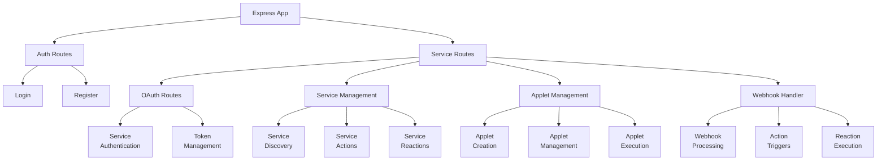

I'll create a comprehensive documentation of the API structure with a diagram and explanation.

# API Documentation

## Architecture Diagram


## Core Components

### 1. Express Application
The main application is built using Express.js and TypeScript, with the entry point defined in:

```ts title="src/app.ts"
import express, { Express, Request, Response } from 'express';
import cors from 'cors';
import { config } from 'dotenv';
import authRoutes from './auth';
import cookieParser from 'cookie-parser';
import servicesRoutes from './services_creator/routes';
import { createAllServices } from './services_creator/creator';
config();

const app: Express = express();
const port: number = 8080;

app.use(express.json());
app.use(cookieParser());

app.use(
  cors({
    origin: [process.env.WEB_BASE_URL as string, process.env.API_BASE_URL as string],
    allowedHeaders: ['Origin', 'X-Requested-With', 'Content-Type', 'Accept'],
    credentials: true,
  })
);

app.use('/api', authRoutes);
app.use(servicesRoutes);

app.get('/api/status', async (req: Request, res: Response) => {
  res.json({ status: 'up', version: '1.0.1d' });
});

app.get('/api/about.json', async (req: Request, res: Response) => {
  const services = await createAllServices();
  if (!services) {
    return res.status(500).json({ message: 'Erreur interne du serveur' });
  }

  const servicesArray = Object.values(services).map((service) => ({
    name: service.name,
    actions: Object.entries(service.actions).map(([name, action]) => ({
      name,
      description: action.description,
    })),
    reactions: Object.entries(service.reactions).map(([name, reaction]) => ({
      name,
      description: reaction.description,
    })),
  }));

  res.json({
    client: {
      host: req.headers['cf-connecting-ip'] || req.socket.remoteAddress,
    },
    server: {
      current_time: new Date().getTime(),
      services: servicesArray,
    },
  });
});
```


### 2. Authentication System
The authentication system handles user registration and login, with routes defined in:

```ts title="src/auth/index.ts"
import { Router } from 'express';
import login from './login';
import register from './register';

const routes: Router = Router();

routes.use(login);
routes.use(register);

export default routes;
```


### 3. Service Management
Services are managed through a dynamic loading system that creates service instances based on the directory structure:

```ts title="src/services_creator/creator.ts"
import { readdir } from 'fs/promises';
import { join } from 'path';
import { Services } from '../types/service';
import { ServiceAction } from '../types/service_action';
import { Applets } from '../types/applet';
import { ServiceReaction } from '../types/service_reaction';

const serviceDir: string = join(__dirname, './services');

const services: Services = {};
async function createAllServices() {
  try {
    const serviceFolders = await readdir(serviceDir, { withFileTypes: true });

    const promises: Promise<void>[] = serviceFolders.map(async (folder) => {
      if (folder.isDirectory()) {
        const oauthPath = join(serviceDir, folder.name, 'oauth');
        const actionsPath = join(serviceDir, folder.name, 'actions');
        const reactionsPath = join(serviceDir, folder.name, 'reactions');

        try {
          let oauthModule;
          let actionsModule;
          let reactionsModule;

          try {
            oauthModule = await import(oauthPath);
            actionsModule = await import(actionsPath);
            reactionsModule = await import(reactionsPath);
          } catch (error) {
            console.log(error);
            throw new Error('A service module was not found.');
          }

          services[folder.name] = {
            name: folder.name,
            description: oauthModule.serviceOAuth.description,
            oauth: oauthModule.serviceOAuth,
            actions: Object.fromEntries(actionsModule.serviceActions.map((action: ServiceAction) => [action.name, action])),
            reactions: Object.fromEntries(reactionsModule.serviceReactions.map((reaction: ServiceReaction) => [reaction.name, reaction])),
          };
        } catch (error) {
          console.error(`Error importing ${folder.name}/oauth.ts:`, error);
        }
      }
    });

    await Promise.all(promises);
    return services;
  } catch (error) {
    console.error('Error reading service directories:', error);
  }
}
const appletDir: string = join(__dirname, './applets');

const applets: Applets = {};
async function createAllApplets() {
  try {
    const appletFolders = await readdir(appletDir, { withFileTypes: true });

    const promises: Promise<void>[] = appletFolders.map(async (folder) => {
      if (!folder.isDirectory()) {
        const appletPath = join(appletDir, folder.name);
        let appletModule;

        try {
          appletModule = await import(appletPath);
        } catch {
          throw new Error('An applet module was not found.');
        }

        applets[appletModule.applet.name] = appletModule.applet;
      }
    });
    await Promise.all(promises);
    return applets;
  } catch (error) {
    console.error('Error reading applet directories:', error);
  }
}

export { createAllServices, createAllApplets };
```


### 4. OAuth Integration
OAuth handling for various services is implemented through a standardized interface:

```ts title="src/types/service_oauth.ts"
type HttpMethod = 'get' | 'post' | 'put' | 'delete' | 'patch' | 'options' | 'head';

export interface AuthorizationRequest {
  baseUrl: string;

  queries: {
    [key: string]: string | string[];
  };
}

export interface TokenRequest {
  baseUrl: string;

  headers?: {
    [key: string]: string;
  };

  data: {
    [key: string]: string;
  };
}

export interface UserIdRequest {
  baseUrl: string;
  method?: HttpMethod;

  headers?: {
    [key: string]: string;
  };

  data?: {
    [key: string]: string;
  };

  parseResponse: (response: any) => any;
}

export interface ServiceOAuth {
  description: string;
  getAuthorizationRequest: (redirect_uri: string) => AuthorizationRequest;
  getTokenRequest: (redirect_uri: string, code: string) => TokenRequest;
  getUserIdRequest: (token: string, instance_url?: string) => UserIdRequest;
}
```


## Key Features

### 1. Service Architecture
Each service (e.g., Discord, GitHub, Google) follows a consistent structure with:
- OAuth configuration
- Actions (triggers)
- Reactions (responses)

Example service structure:

```ts title="src/services_creator/services/discord/oauth.ts"
import { AuthorizationRequest, ServiceOAuth, TokenRequest, UserIdRequest } from '../../../types/service_oauth';
import { config } from 'dotenv';

config();

const client_id: string = process.env.DISCORD_CLIENT_ID as string;
const client_secret: string = process.env.DISCORD_CLIENT_SECRET as string;

const getAuthorizationRequest = (redirect_uri: string): AuthorizationRequest => ({
  baseUrl: 'https://discord.com/oauth2/authorize',

  queries: {
    response_type: 'code',
    client_id,
    redirect_uri,
    scope: ['identify', 'guilds', 'bot'],
    bot: 'true',
    guild_select: 'true',
    permissions: '2048',
  },
});

const getTokenRequest = (redirect_uri: string, code: string): TokenRequest => ({
  baseUrl: 'https://discord.com/api/v10/oauth2/token',

  headers: {
    'Content-Type': 'application/x-www-form-urlencoded',
    Authorization: `Basic ${Buffer.from(`${client_id}:${client_secret}`).toString('base64')}`,
  },

  data: {
    grant_type: 'authorization_code',
    code,
    redirect_uri,
  },
});

const getUserIdRequest = (token: string): UserIdRequest => ({
  baseUrl: 'https://discord.com/api/users/@me',

  headers: {
    Authorization: `Bearer ${token}`,
  },

  parseResponse: (response: any): any => ({ id: response?.id }),
});
export const serviceOAuth: ServiceOAuth = {
  description:
    'Discord is a free VoIP application and digital distribution platform designed for creating communities ranging from games to education and businesses.',
  getAuthorizationRequest,
  getTokenRequest,
  getUserIdRequest,
};
```


### 2. Applet System
Applets are configurable automation rules that connect actions to reactions:

```ts title="src/types/applet.ts"
// Global imports
import { Request } from 'express';

// Scoped imports
import { InputParams, OutputParams } from './service_reaction';
import { ActionData } from './action_data';

interface AppletAction {
  serviceName: string;
  name: string;
}

interface AppletReaction {
  serviceName: string;
  name: string;
  getOutputParams: (data: ActionData, inputParams: InputParams, request: Request) => Promise<OutputParams>;
}

type AppletField = {
  name: string;
  title: string;
};

export interface Applet {
  name: string;
  title: string;
  fields: AppletField[];
  description: string;
  action: AppletAction;
  reaction: AppletReaction;
}

export interface Applets {
  [name: string]: Applet;
}
```


### 3. Webhook Management
The system handles incoming webhooks for various services:

```ts title="src/services_creator/routes/webhook.ts"
// Global imports
import { Router, Request, Response } from 'express';

// Scoped imports
import { createAllApplets, createAllServices } from '../creator';
import { ServiceReaction } from '../../types/service_reaction';
import { Params } from '../../types/service_action';
import { pool } from '../../utils/db';
import { Applet } from '../../types/applet';
import { Service } from '../../types/service';
import { ActionData, ActionResult } from '../../types/action_data';

const routes: Router = Router();
const nonces: string[] = [];

routes.post('/api/webhook/:service_name/:action_name', async (request: Request, response: Response) => {
  const { service_name, action_name } = request.params;

  const services = await createAllServices();
  const applets = await createAllApplets();

  if (!services || !applets) {
    return response.status(500).json({ message: 'Internal server error' });
  }

  if (!services.hasOwnProperty(service_name)) {
    return response.status(404).json({ message: 'Service not found' });
  }

  const service = services[service_name];

  if (!service.actions.hasOwnProperty(action_name)) {
    return response.status(404).json({ message: 'Action not found' });
  }

  const action = service.actions[action_name];

  if (!service || !action) {
    return response.status(404).json({ message: 'Service and/or action not found' });
  }

  let client;

  try {
    client = await pool.connect();

    const parsed: ActionResult | undefined = await action.onWebhook(request, response);

    if (!parsed) {
      return response.json({ message: 'Event ignored because user is not found' });
    }

    if (parsed.is_response_ended) {
      return response;
    }

    if (parsed.nonce) {
      if (nonces.includes(parsed.nonce)) {
        return response.json({ message: 'Event ignored because nonce is already used' });
      }

      nonces.push(parsed.nonce);
    }
    if (!parsed.provided_user_id) {
      return response.json({ message: 'Event ignored because user is not found' });
    }

    const internalUser = await client.query(
      `SELECT users.id FROM users
      JOIN user_providers ON users.id = user_providers.user_id
      JOIN providers ON user_providers.provider_id = providers.id
      WHERE providers.account_id = $1 AND providers.account_name = $2`,
      [parsed.provided_user_id, service_name]
    );

    if (internalUser.rowCount === 0) {
      return response.json({ message: 'Event ignored because user is not found' });
    }

    const providedUser = await client.query('SELECT * FROM providers WHERE account_id = $1 AND account_name = $2', [
      parsed.provided_user_id,
      service_name,
    ]);

    if (providedUser.rowCount === 0) {
      return response.json({ message: 'Event ignored because user is not found' });
    }

    const data: ActionData = {
      user: {
        id: internalUser.rows[0].id,
      },
      provided_user: {
        id: providedUser.rows[0].account_id,
        email: providedUser.rows[0].account_email,
        token: providedUser.rows[0].account_token,
      },
      input: parsed.input,
    };

    let selectedApplets = await client.query('SELECT * FROM applets WHERE user_id = $1', [data.user.id]);
    await Promise.all(
      selectedApplets.rows.map(async (selectedApplet: { name: string; config: { [key: string]: string } }) => {
        if (!(selectedApplet.name in applets)) {
          return;
        }

        const applet: Applet | undefined = applets[selectedApplet.name];

        if (!applet) {
          return;
        }

        if (!(applet.reaction.serviceName in services)) {
          return;
        }

        const reactionService = services[applet.reaction.serviceName];

        if (!reactionService) {
          return;
        }

        const reaction: ServiceReaction | undefined = reactionService.reactions[applet.reaction.name];

        if (!reaction) {
          return;
        }

        const outputParams = await applet.reaction.getOutputParams(data, selectedApplet.config, request);

        await reaction.handleReaction(data, outputParams);
      })
    );
  } catch (error) {
    console.error('routes/webhook.ts', error);
  } finally {
    client?.release();
  }
});

export default routes;
```


## Database Integration
The application uses PostgreSQL for data persistence:

```ts title="src/utils/db.ts"
import { Pool } from 'pg';
import { config } from 'dotenv';

config();

const pool = new Pool({
  max: 32,
  host: process.env.POSTGRES_HOST || 'db',
  user: process.env.POSTGRES_USER,
  password: process.env.POSTGRES_PASSWORD,
  database: process.env.POSTGRES_DB,
  port: 5432,
});

export { pool };
```


## Development and Deployment

### Local Development
The application can be run locally using Docker:

```dockerfile title="Dockerfile.local"
FROM node:18

WORKDIR /app

COPY ./package*.json ./
COPY ./tsconfig.json ./

RUN npm install

EXPOSE 8080

CMD [ "npm", "run", "dev" ]

```


### Production Deployment
Production deployment is configured with:

```dockerfile title="Dockerfile.prod"
FROM node:18

WORKDIR /app

COPY ./package*.json ./
COPY ./tsconfig.json ./

COPY .env.prod .env

RUN npm install

COPY ./src ./src

RUN npm run build

EXPOSE 8080

CMD [ "npm", "run", "start" ]

```


## Adding New Services

To add a new service to the platform:

1. Create a new service directory in `src/services_creator/services/[SERVICE_NAME]`
2. Implement the required interfaces:
   - OAuth configuration
   - Actions
   - Reactions
3. Add environment variables for OAuth credentials
4. Create applets utilizing the new service

## Security Considerations

1. Token Management
   - JWT tokens for user authentication
   - OAuth tokens stored securely in database
   - Automatic token refresh handling

2. Request Validation
   - Input validation using Joi schemas
   - Request sanitization
   - CORS configuration

3. Error Handling
   - Standardized error responses
   - Proper error logging
   - Graceful failure handling

This API structure provides a flexible and extensible platform for creating and managing automated workflows between different services through a standardized interface.
