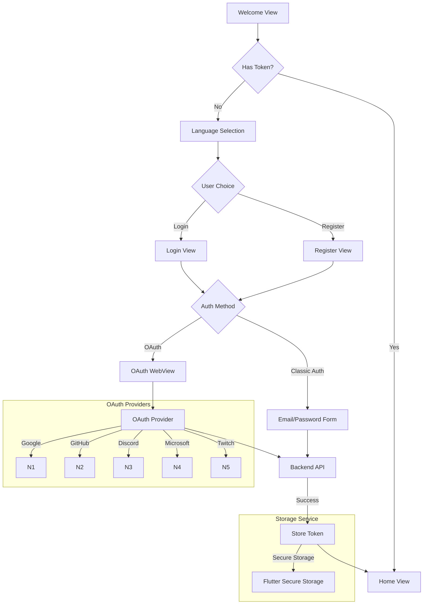

# Mobile Client for AREA Project

## Overview

The Mobile Client is part of the AREA project, which integrates various services to enable automated actions and reactions. This client provides a user-friendly mobile interface for connecting and managing multiple service integrations.

## Features

- **Multi-Service Integration:** Connect with popular platforms:
  - Google (Gmail, Drive, Calendar)
  - Microsoft (Outlook, OneDrive)
  - Discord
  - GitHub
  - Twitch

- **Authentication Options:**
  - Email/Password registration
  - OAuth2 integration with supported services
  - Secure token management

- **Localization Support:**
  - English and French languages
  - Dynamic language switching
  - Localized UI elements and error messages

- **Theme Customization:**
  - Light and dark themes
  - System theme following
  - Dynamic theme switching

- **Applet Management:**
  - Enable/disable automation workflows
  - Configure webhook endpoints
  - Monitor applet status

## Architecture



## Getting Started

### Prerequisites

- Flutter SDK (latest stable version)
- Android Studio or VS Code with Flutter extensions
- Basic knowledge of Flutter development

### Installation

1. Clone the repository:
```bash
git clone <repository-url>
cd <repository-directory>
```

2. Install dependencies:
```bash
flutter pub get
```

3. Create a `.env` file in the root directory with the following variables:
```
API_BASE_URL=your_api_url
GITHUB_CLIENT_ID=your_github_client_id
GOOGLE_CLIENT_ID=your_google_client_id
MICROSOFT_CLIENT_ID=your_microsoft_client_id
DISCORD_CLIENT_ID=your_discord_client_id
```

### Development Commands

- **Run Web Server:**
```bash
make run-web
```

- **Build APK:**
```bash
make build-apk
```

- **Clean Build:**
```bash
make clean
```

- **Code Analysis:**
```bash
make analyze
```

- **Run Tests:**
```bash
make test
```

## Docker Integration

Build and run the mobile client with other services:

```bash
# Build containers
docker-compose build

# Start services
docker-compose up
```

Services:
- Application server: `http://localhost:8081`
- Web client: `http://localhost:8082`
- Mobile client build process

## API Integration

- **Server Endpoint:** `http://localhost:8081/about.json`
  - Provides service configurations
  - Action/reaction mappings
  - Authentication endpoints

- **Client Download:** `http://localhost:8082/client.apk`
  - Latest Android APK build
  - Automated CI/CD deployment

## Documentation

For detailed technical documentation, architecture diagrams, and API specifications, refer to the `/docs-area` directory in the project repository.

## Security

- Secure token storage using device encryption
- OAuth2 implementation for third-party services
- HTTPS communication with API endpoints
- Input validation and sanitization
